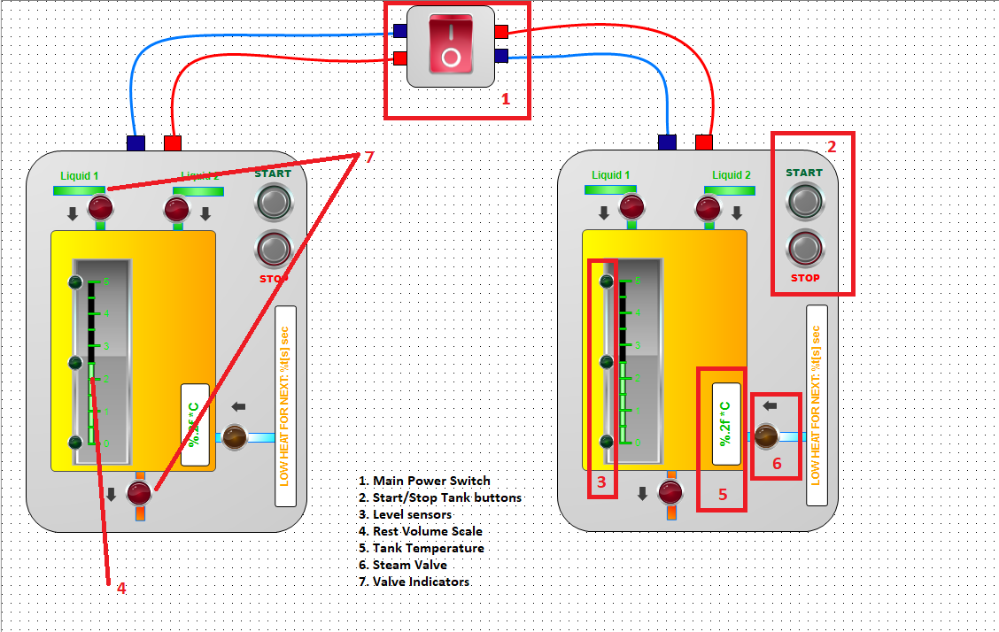

# Liquid Mixing and Heating Control System

## Purpose
This project automates the mixing and heating of liquid components within an industrial technological setup. It is designed to ensure efficient, consistent, and high-quality results by coordinating various sensors, valves, and a programmable logic controller (PLC).

## System Composition
The system comprises the following components:
- **Mixing Tanks**: Two identical tanks for the initial mixing of liquid components.
- **Receiving Tank**: A smaller tank for collecting the combined mixture.

## Key Principles
The process is controlled and optimized using:
- **Valves**: To manage the flow of liquid and steam.
- **Level Sensors**: To maintain the appropriate liquid levels in the tanks.
- **Temperature Sensors**: To monitor and regulate heating conditions.
- **Programmable Logic Controller (PLC)**: To automate actions, monitor data, and adjust parameters dynamically for optimal operation.

This setup ensures precise control over the process, achieving the desired mixture quality and temperature specifications.

## Process Workflow

1. **Initialization**  
   - Press the `START` button to initiate the sequence.

2. **Component Mixing**  
   - The valve for the first component opens, allowing the liquid to flow into a mixing tank.
   - Once the specified level is reached, the valve closes, and the second component's valve opens for proper mixing.

3. **Level Monitoring**  
   - Level sensors monitor liquid levels in the tanks.
   - If the upper limit is detected in the second tank, its valve closes automatically to prevent overflow.

4. **Heating**  
   - After mixing, the steam valve opens fully (100%) to introduce steam and heat the mixture.
   - The temperature sensor ensures the mixture reaches 95°C.
   - Once the temperature is reached, the steam valve adjusts to 20% to maintain the temperature for an additional 10 seconds.

5. **Aging Period**  
   - After heating, the mixture is held in the tank for settling or chemical reactions as needed.

6. **Draining**  
   - The drain valve opens to release the liquid.
   - Once the liquid level drops below the sensor’s threshold, the valve automatically closes.

7. **Cycle and Stop**  
   - The process continues in a cycle unless the `STOP` button is pressed.
   - Pressing `STOP` halts the process and ensures all valves are securely closed.

## Visualization

## How to Use
1. Press `START` to begin the process.
2. Monitor the system via connected sensors and the PLC interface.
3. Press `STOP` to halt the process when required.

## Development Environment  
This project was developed using **CODESYS V3.5 SP17 Patch 3**.  

## Setup Process  
To set up and run this project, follow these steps:  

1. **Install CODESYS**  
   - Download and install **CODESYS V3.5 SP17 Patch 3** from the [official website](https://www.codesys.com/).  

2. **Open the Project**  
   - Clone this repository to your local machine.  
   - Open the `.project` file using CODESYS.  

3. **Configure the Hardware**  
   - Ensure the target PLC or runtime system is set up and compatible with CODESYS V3.5 SP17 Patch 3.  
   - Connect the required sensors and actuators (e.g., level sensors, valves, and temperature sensors).  

4. **Deploy and Test**  
   - Compile and download the project to the connected PLC.  
   - Test the process flow by pressing `START` and monitoring the system behavior.  

5. **Adjust Parameters (Optional)**  
   - Modify the control parameters (e.g., temperature thresholds, valve timings) as needed to suit your specific setup.  
